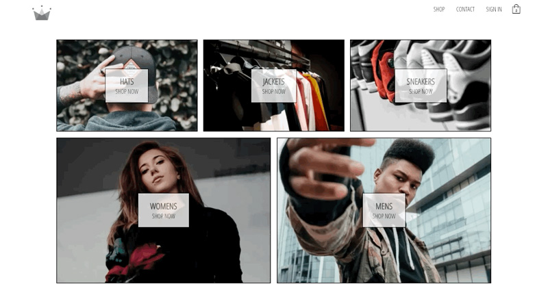

# Crwn-Clothing, a React bases Ecommerce project

This project is bootstrapped with create-react-app. It is an ecommerce site similar to shopify with login, authentication, shopping cart, and connected to Stripe test portal.

## Tech Stack

**FrontEnd Tech**

React, Redux, React Router, Context API, Firebase, Stripe API Styled-Components. Fullstack (MERN) app that uses Firebase.

**BackEnd Tech**

Node.js, npm, nodemon, express, body-parser, dotenv

## Steps to create

The following are the steps I took to plan and build this website.

- Create React App
- Add App.js, and components (static content)
- Add Sass
- Add Google Fonts
- Add Routing: react-router
- Create navigation bar using react-router
- Get routing to work for home and shop pages
- Style navigation
- Create sign in and sign up components
- Setup Authentication and DB with Firebase.
- Created User context and provider
- Moved auth code for signin into user provider.
- Setup React contexts for the cart, categories and user.
- Converted Sass to styled components.
- Deployed to production site using Netlify.

## Test Password Sign In

- Email: flyfisher@gmail.com
- Password: letsfish01
- DisplayName: Fisherman Bob

## Deleting Test User from Firebase

1. Go to Firestore Database an delete...
2. Go to Authentication and next to account click Delete account.
